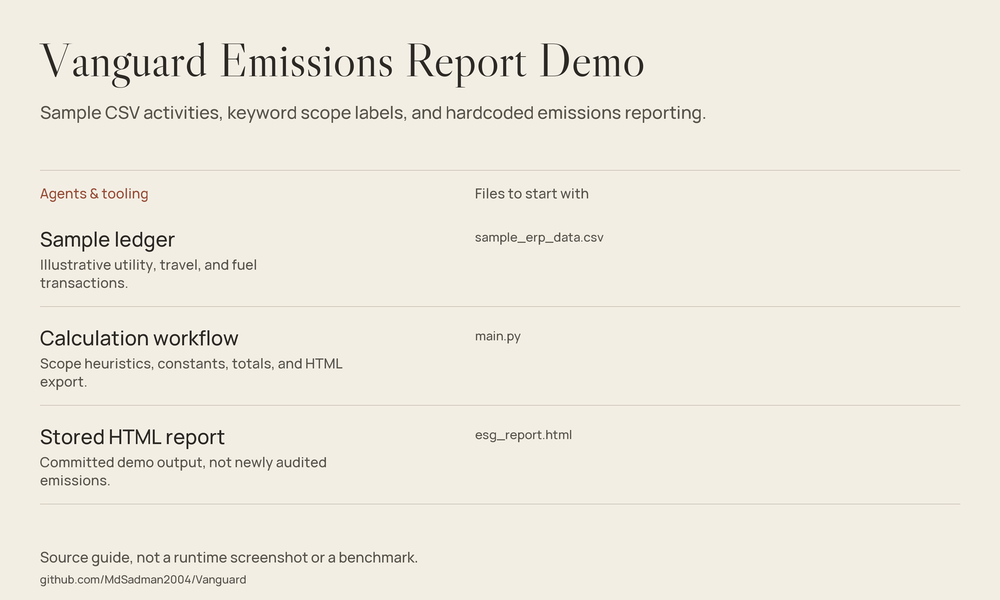

# Vanguard — Ledger-to-Emissions Reporting Demo



*Source guide drawn from the files in this repository; not a runtime screenshot or a fresh benchmark.*

**A small LangGraph workflow that turns a sample CSV ledger into an emissions-style HTML report.**
Vanguard reads activity quantities, assigns one of three scope labels using
keywords, multiplies by hardcoded factors, and renders totals with a transaction
table. It demonstrates a data-to-report workflow, not verified ESG compliance.

## What the implementation does

| Stage | Behavior |
|---|---|
| Normalize | Read CSV rows with `csv.DictReader`; use embedded examples if the file is absent. |
| Classify | Recognize diesel/fuel as Scope 1 and grid/electricity/power as Scope 2. |
| Calculate | Apply the selected factor to the numeric quantity and aggregate totals. |
| Export | Write `esg_report.html` with scope bars, a footprint display, and ledger rows. |

All other descriptions fall into the Scope 3 flight category by default.
There is no factor lookup service, rules-file loader, LLM call, or
uncertainty/discrepancy audit node.

## Getting started

Use a Python environment compatible with
[requirements.txt](requirements.txt). Python 3.10+ is a reasonable starting
point, but this repository does not declare a Python version or lockfile.

```bash
git clone https://github.com/MdSadman2004/Vanguard.git
cd Vanguard
python -m venv .venv
```

Activate the environment (`source .venv/bin/activate` on POSIX;
`.venv\Scripts\Activate.ps1` in Windows PowerShell), then:

```bash
python -m pip install -r requirements.txt
python main.py
```

The entry point reads `sample_erp_data.csv` beside `main.py` and replaces
`esg_report.html` in that directory. Open the generated report locally.
There is no `vanguard.audit` module or `--ledger`/`--rules` command-line parser.

The requirements list LangGraph, LangChain Core, python-dotenv, and Pydantic.
The current calculation is ordinary Python with a LangGraph state workflow;
Pandas, a database driver, and a model API key are not used by this script.

## Input contract

The sample CSV includes:

```text
TRANSACTION_ID,DATE,ACCOUNT,DESCRIPTION,AMOUNT,QTY
```

`DESCRIPTION` and `QTY` are required by the classifier. `QTY` must start with
a numeric token. The next space-separated token, if present, is displayed as
the unit; bare numeric quantities are also accepted. Sample values include
`12500 kWh`, `3 tickets`, and `420 gallons`.

The calculation uses quantity, not `AMOUNT`. Account codes do not determine
scope. The units are displayed but are not validated or converted.
To try another input, copy the sample first and change the input path in
`main.py`; the script does not expose a file-selection CLI.

## Demonstration factor table

These constants are copied from `EMISSION_FACTORS` in the source, where they
are described as metric tons CO2e per unit. They are **not certified factors**.

| Factor key | Value in the code |
|---|---:|
| `scope_1_diesel` | 0.0101 |
| `scope_2_electricity` | 0.00017 |
| `scope_3_flights` | 0.68 |

## Source guide

| File | Purpose |
|---|---|
| [Workflow and calculation](main.py) | CSV loading, scope heuristics, factor constants, and HTML export. |
| [Sample ledger](sample_erp_data.csv) | Three illustrative utility, travel, and fuel transactions. |
| [Stored report](esg_report.html) | Committed demonstration output, not a fresh compliance result. |
| [Dependencies](requirements.txt) | Declared dependency lower bounds. |

## Scope & limitations

- CSV is the implemented input format; no Excel or ERP/database integration is bundled.
- Unknown activities silently use the flight factor; unsupported units can
  still produce plausible-looking totals. There is no validation audit.
- The factors have no linked provenance, geography, reporting-year selection,
  supplier data, or unit-conversion logic in the implementation.
- Scope labels are illustrative. This does not establish conformance with
  GHG Protocol, regulatory disclosure rules, or third-party assurance requirements.
- The report inserts row text into HTML without escaping. Use trusted sample data.
  It also imports Google Fonts, so browser viewing can make external requests.
- No dashboard server, benchmarks, or automated tests were run for this refresh.
  Stored report values should not be presented as audited organizational emissions.

## Credits and license

Original README notice: `MIT © Md Sadman Bin Masud`.
No standalone license file is present. This refresh preserves the existing
notice without adding license terms or changing the project's licensing.
